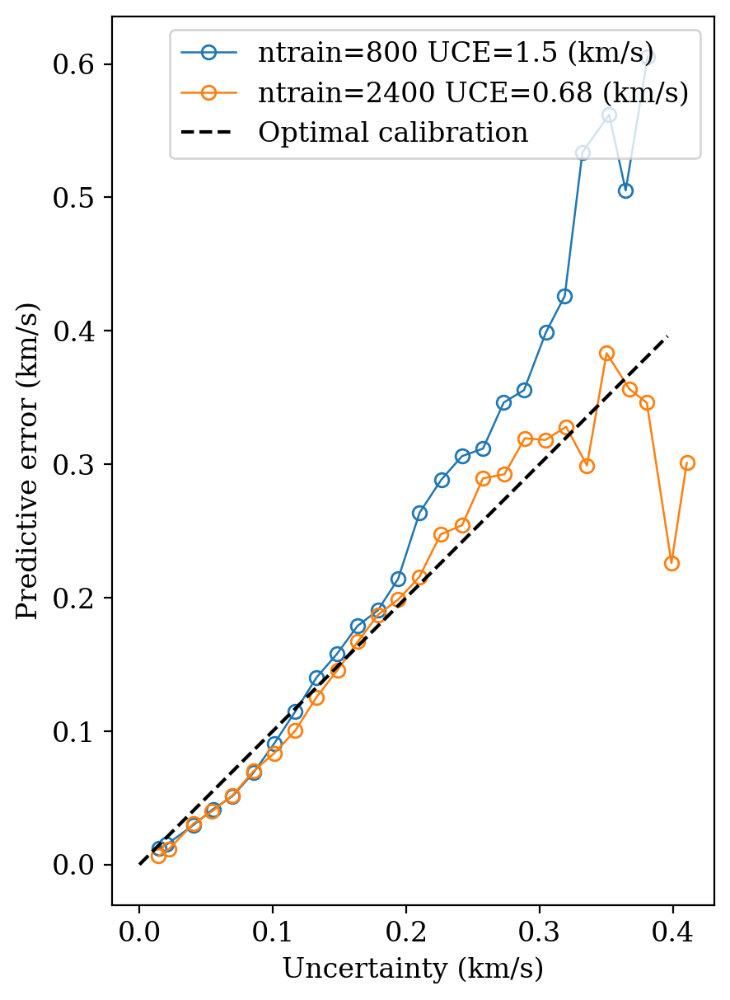
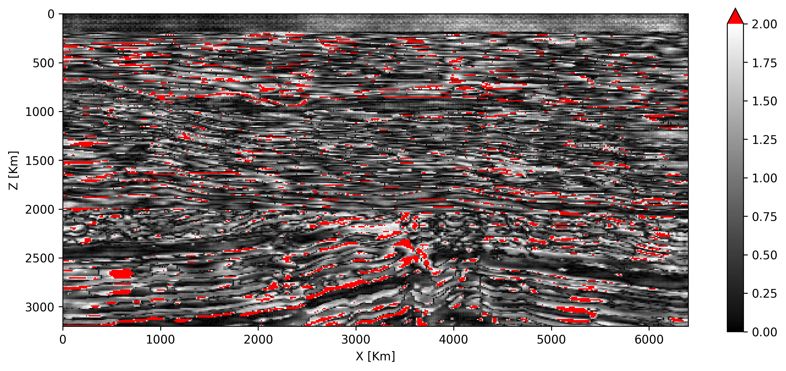
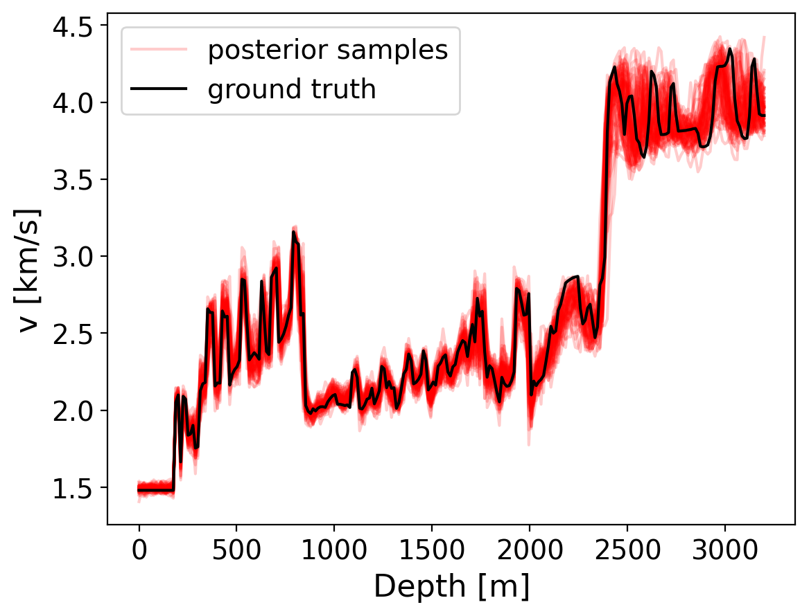
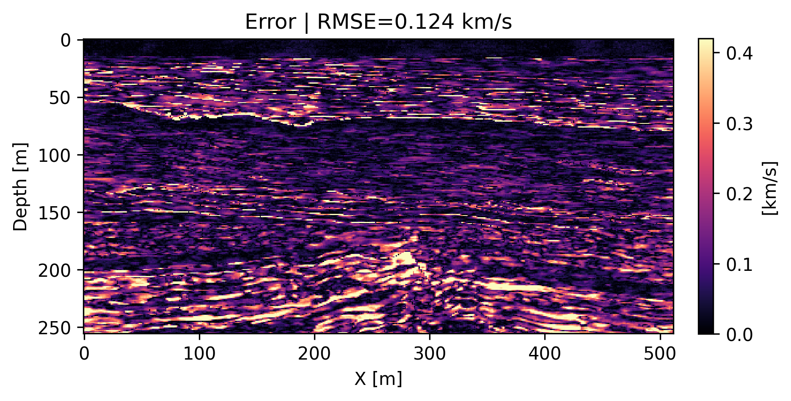
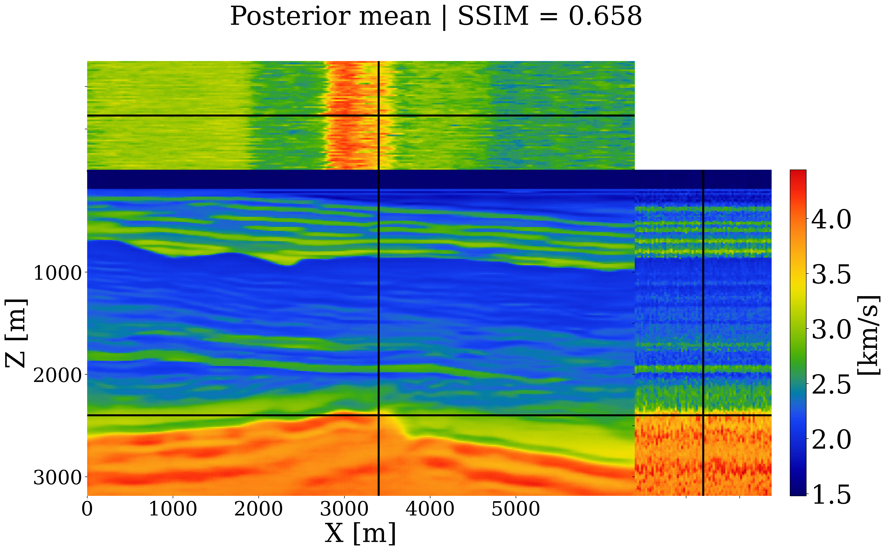

# Uncertainty Analysis Toolkit

A comprehensive toolkit for uncertainty quantification and analysis of posterior samples from Bayesian inverse problems, particularly focused on image-based data.

## Overview

This repository provides functions for analyzing and visualizing uncertainty in posterior distributions, with emphasis on:
- Posterior sample analysis for image data
- Uncertainty quantification metrics
- Calibration analysis 
- Coverage assessment
- Statistical validation of Bayesian methods

## Core Analysis Functions

### 1. Posterior Summary Visualization
- **`plot_x_gt()`**: Ground truth velocity model visualization
- **`plot_x_hat()`**: Posterior mean with Structural Similarity Index (SSIM) metric
- **`plot_error()`**: Absolute error mapping with Root Mean Square Error (RMSE) 
- **`plot_uncert()`**: Posterior standard deviation (uncertainty) visualization
- **`plot_posterior()`**: Comprehensive analysis combining all above plots

### 2. Uncertainty Calibration Analysis
- **`plot_calibration()`**: **Calibration curve analysis** - Tests how well predicted uncertainties align with observed errors by plotting the relationship E[||x_gt - x_hat|| | σ_hat = σ] = σ. Ideal calibration follows the 45° line where predicted uncertainties match observed errors.
- **`compute_calibration()`**: Computes Uncertainty Calibration Error (UCE) by binning predicted uncertainties and measuring discrepancy between predicted uncertainties and actual errors
- **`uceloss()`**: Core UCE computation measuring calibration quality

### 3. Z-Score Analysis  
- **`plot_z_score()`**: **Z-score distribution mapping** - Visualizes the pixel-wise ratio Z = ||x_mean - x_gt|| / x_std, highlighting regions where Z > 2 (indicating underestimated uncertainty). Ideal Z-scores should be close to 1 across all pixels.
- **`compute_z_score()`**: Computes standardized residuals to evaluate uncertainty quality by measuring how well predicted uncertainty captures actual prediction error

### 4. Posterior Coverage Assessment
- **`compute_coverage()`**: **Coverage rate analysis** - Evaluates whether ground truth values fall within posterior confidence intervals (e.g., 1st-99th percentiles). High coverage rates indicate that posterior samples appropriately capture the ground truth distribution.
- **`compute_empirical_coverage()`**: Computes fraction of pixels where ground truth falls within specified confidence intervals

## Scientific Background

These uncertainty quantification methods are based on established practices in Bayesian inverse problems:

- **Calibration Analysis**: Validates that predicted uncertainties align with observed errors, ensuring reliable uncertainty estimates
- **Z-Score Analysis**: Identifies regions where uncertainty is underestimated (Z > 2) or overestimated (Z < 1)  
- **Coverage Analysis**: Assesses whether posterior samples provide adequate coverage of the true parameter space

## Input Requirements
All functions work with:
- **Posterior samples**: 4D array (nx, nz, 1, n_samples) - velocity models or seismic images
- **Ground truth data**: 2D array (nx, nz) - reference velocity model  
- **Spatial coordinates**: Grid spacing (dx, dz) in meters for proper scaling

## Key Plotting Functions

### Core Visualization Functions
```julia
# Individual plot functions (adapted from utils_inference.jl)
plot_x_gt(x_gt, output_dir, config)                    # Ground truth
plot_x_hat(X_post, x_gt, output_dir, config)          # Posterior mean + SSIM  
plot_error(X_post, x_gt, output_dir, config)          # Error map + RMSE
plot_uncert(X_post, output_dir, config)               # Uncertainty map
plot_calibration(uce, uncert_bin, errors_bin, ...)    # Calibration curve
plot_z_score(z_score, perc_all, output_dir, config)   # Z-score distribution
```

### Comprehensive Analysis
```julia
# Complete posterior analysis workflow
plot_posterior(X_post, x_gt, output_dir, config)      # All plots + metrics
```

### Metric Computation Functions
```julia
# Statistical analysis
compute_calibration(test_idx, output_dir; X_post, x_gt, n_bins)  # UCE + binned data
compute_z_score(X_post, x_gt, threshold)                        # Z-score analysis  
compute_coverage(X_post, x_gt; confidence_level)                # Coverage statistics
compute_coverage_statistics(posterior_samples, ground_truth, confidence_levels)
compute_zscore_statistics(posterior_samples, ground_truth)
compute_pixelwise_rmse(posterior_samples, ground_truth)
```

### Utility Functions
```julia
# Data processing
validate_input_dimensions(posterior_samples, ground_truth)
compute_posterior_statistics(posterior_samples)
extract_confidence_intervals(posterior_samples, confidence_levels)
```

## Dependencies

- PyPlot.jl (for visualization)
- Statistics.jl (for statistical computations)
- StatsBase.jl (for advanced statistics)
- Images.jl (for image processing utilities)

## Usage Example

```julia
using UncertaintyAnalysis

# Load your data
posterior_samples = load_posterior_samples()  # Shape: (nx, nz, 1, n_samples)
ground_truth = load_ground_truth()           # Shape: (nx, nz)

# Generate comprehensive uncertainty analysis
plot_posterior_mean(posterior_samples, ground_truth, save_path="results/")
plot_error_map(posterior_samples, ground_truth, save_path="results/")
plot_uncertainty_calibration(posterior_samples, ground_truth, save_path="results/")
plot_coverage_analysis(posterior_samples, ground_truth, [0.68, 0.95], save_path="results/")

# Compute metrics
uce = compute_uce(posterior_samples, ground_truth)
coverage_stats = compute_coverage_statistics(posterior_samples, ground_truth, [0.68, 0.95])
```

## File Structure

```
Uncertainty-Analysis/
├── README.md
├── src/
│   ├── visualization/
│   │   ├── posterior_plots.jl
│   │   ├── error_plots.jl
│   │   ├── calibration_plots.jl
│   │   └── coverage_plots.jl
│   ├── metrics/
│   │   ├── calibration_metrics.jl
│   │   ├── coverage_metrics.jl
│   │   └── statistical_metrics.jl
│   └── utils/
│       ├── input_validation.jl
│       └── data_processing.jl
└── examples/
    └── uncertainty_analysis_example.jl
```

## Sample Output Figures

### Calibration Analysis

**Calibration curve comparison** showing predicted uncertainty vs. observed error. The ideal 45° line indicates perfect calibration. The enhanced method (orange) aligns closer to optimal calibration compared to baseline (blue), with significantly reduced UCE.

### Z-Score Analysis  

**Z-score distribution map** highlighting regions where error/uncertainty > 2 (shown in red). Lower percentages of red regions indicate better uncertainty quantification. Enhanced methods typically show reduced outlier regions.

### Posterior Coverage Assessment
  
**Posterior coverage visualization** showing vertical slices through velocity models. Black curve represents ground truth, while red curves show posterior sample traces. Good coverage ensures ground truth falls within the posterior sample range, with uncertainty increasing naturally with depth.

### Additional Visualizations

**Error visualization** showing absolute differences between posterior mean and ground truth


**Comprehensive posterior analysis** displaying multiple posterior samples and summary statistics

## File Structure

```
Uncertainty-Analysis/
├── README.md
├── uncertainty_analysis.jl          # Main CLI executable  
├── example_config.toml              # Configuration template
├── example_usage.jl                 # Usage examples
├── sample_figs/                     # Sample output figures
│   ├── calibration_comparison.png   # Calibration curve example
│   ├── z_score.png                  # Z-score distribution  
│   ├── trace.png                    # Coverage analysis
│   ├── error.png                    # Error visualization
│   └── juxtapose.png                # Posterior summary
└── src/
    ├── UncertaintyAnalysis.jl       # Main module
    ├── plotting.jl                  # Visualization functions
    ├── calibration.jl               # UCE computation
    ├── coverage.jl                  # Coverage analysis
    ├── metrics.jl                   # Statistical metrics
    └── utils.jl                     # Utility functions
```

## Contributing

This toolkit is designed for robust uncertainty analysis in scientific computing applications. Functions should maintain consistency with image-based data formats and provide comprehensive uncertainty assessment capabilities.